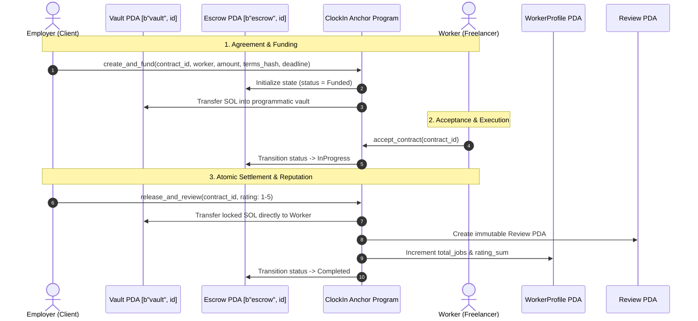

# ClockIn

> **Lock funds. Do the work. Get paid and reviewed — atomically.**

ClockIn is a mobile-first **P2P Work Contract & Escrow Protocol** built on Solana. It enables freelancers, gig workers, and clients to negotiate agreements, lock milestone deposits safely inside Program Derived Address (PDA) escrow vaults, and execute guaranteed payment releases that mint permanent on-chain reputation at the exact moment of settlement.

Built for the **[CLOCK IN](https://solanamobile.radiant.nexus/)** Solana Mobile Hackathon.

---

## The Problem & The ClockIn Solution

| Traditional Gig Economy | ClockIn Escrow Protocol |
|---|---|
| **High Middleman Fees**: Platforms take 10%–20% cuts on every invoice. | **Zero Platform Cut**: Peer-to-peer on Solana. Only standard network gas fees apply. |
| **Payment Risk**: Freelancers risk non-payment; employers risk paying for incomplete work. | **Atomic Escrow PDAs**: Client locks SOL in a programmatic vault; funds can only be released upon completion or refunded on mutual cancellation. |
| **Walled-Garden Reputation**: Upwork or Fiverr ratings are locked inside closed corporate silos and reset to zero on new platforms. | **Portable, Public Reputation**: Ratings and reviews are inscribed into Anchor program PDAs that follow your Solana address everywhere. |
| **Custodial Key Exposure**: Apps require custody of API keys or private keys. | **Zero Key Custody**: 100% Mobile Wallet Adapter (MWA) v2.0 authorization. Private keys never touch ClockIn. |

---

## Core Protocol Mechanics



### Protocol Instructions
1. **`create_contract`**: Client defines contract ID, counterparty worker address, amount, terms hash, and deadline (`status: Created`).
2. **`fund_contract`**: Client deposits SOL from wallet into the programmatic Vault PDA (`status: Funded`).
3. **`create_and_fund`**: Single-transaction convenience method combining creation and funding.
4. **`accept_contract`**: Worker reviews terms and commits to the contract (`status: InProgress`).
5. **`release_and_review`**: **The atomic settlement instruction**. Releases vault SOL to the worker, creates a verified `Review` PDA, updates `WorkerProfile` aggregate score, and sets contract to `Completed`.
6. **`cancel_contract`**: Reclaims locked vault SOL back to employer if worker has not yet accepted (`status: Cancelled`).
7. **`raise_dispute`**: Flags on-chain breach of terms for either party (`status: Disputed`).

---

## On-Chain Deployment (Solana Devnet)

| Parameter | Value |
|---|---|
| **Program ID** | [`FKicZKbepmiwj2rTnPrHNRBPAja3G5gSvi7KFkjHdEt9`](https://explorer.solana.com/address/FKicZKbepmiwj2rTnPrHNRBPAja3G5gSvi7KFkjHdEt9?cluster=devnet) |
| **Cluster** | Solana Devnet (`https://api.devnet.solana.com`) |
| **Slot Deployed** | `499476909` (Upgrade Tx: [`4KYwnZ1…`](https://explorer.solana.com/tx/4KYwnZ1B7M2PYVrPZuj67a4P436hP9RnsHwk8EatJGaT2yLJXUJUDeG19c1R5fZQYLxJ9uaARDLUvgWMbx9gDdkp?cluster=devnet)) |
| **Binary Size** | 293,736 bytes |
| **Sample Escrow Contract** | [`ctr-mu4o1bhi`](https://explorer.solana.com/tx/2tvjD8XQezFBbzQXyD2VtR5vzae2ynLdCs6XLb4hAkyEqRbFGr5PexYtNPoi8xSojktbbLA9rSmdib7DUNSyZ2TT?cluster=devnet) (Status: `Completed`, 5★ review) |

See [`program/DEPLOYED.md`](program/DEPLOYED.md) for the full on-chain deployment record and live transaction logs.

---

## Mobile Architecture & Technology Stack

- **Flutter / Dart**: High-performance mobile UI built with design tokens matching Google Stitch UI specifications.
- **Solana Mobile Wallet Adapter (MWA)**: Zero key custody. Sessions and transactions are signed natively inside installed wallets (Phantom, Solflare) using Android intent handoffs.
- **Drift (SQLite)**: Offline-first reactive local cache. Automatically mirrors on-chain contracts, worker profiles, and reviews for fast startup, offline draft review authoring, and low RPC overhead.
- **Riverpod 2.0**: Declarative reactive state management streaming contract updates and wallet session status.
- **Anchor 1.2.0 / Solana SBF**: Rust program enforcing deterministic PDA derivation, space bounding, and atomicity.

---

## Repo Layout

```
ClockIn/
├── program/                      # Solana Anchor smart contract
│   ├── programs/reputation/      # Rust program source (7 instructions, 5 accounts)
│   ├── tests/                    # Mocha/Chai test suite (22 unit test cases)
│   ├── scripts/                  # On-chain devnet lifecycle & seeding scripts
│   └── Anchor.toml               # Anchor workspace configuration
├── app/                          # Flutter Android mobile application
│   ├── lib/
│   │   ├── core/                 # Database (Drift), Theme, Solana RPC & Providers
│   │   └── features/             # Contracts, Reviews, Profile, Look Up, Settings, Wallet
│   ├── test/                     # Unit, Drift in-memory repository, & Widget tests
│   └── android/                  # Native Android configuration & mipmap icons
└── docs/                         # Specifications & Architectural Documentation
    ├── ARCHITECTURE.md           # System architecture, trust model, & data flow
    ├── ROADMAP.md                # Phase-by-phase implementation roadmap
    ├── PROGRAM_SPEC.md           # Smart contract account schemas & instruction specifications
    └── APP_SPEC.md               # Mobile screens, view states, & service layer
```

---

## Getting Started

### Prerequisites
- **Flutter SDK**: 3.29.x / Dart 3.7.x
- **Solana CLI**: 3.1.x / `solana-cli`
- **Anchor CLI**: 1.2.0
- **Android Device or Emulator** with [Phantom](https://phantom.app/) or [Solflare](https://solflare.com/) installed.

### 1. Build and Test the Anchor Program
```bash
cd program
# Build SBF executable
cargo build-sbf --arch v1 --sbf-out-dir target/deploy

# Run TypeScript integration test suite against local validator
anchor test --skip-build --validator legacy
```

### 2. Run or Install the Flutter Mobile App
```bash
cd app
flutter pub get

# Run test suite (17 tests including Drift SQLite in-memory tests)
flutter test

# Run app on connected Android device
flutter run

# Or build the release APK directly
flutter build apk --release
# Output: app/build/app/outputs/flutter-apk/app-release.apk (78 MB)
```

### 3. Wallet Configuration (Crucial for Devnet Testing)
ClockIn is currently deployed on **Solana Devnet**. Ensure your mobile wallet is set to Devnet prior to connecting:
- **Phantom**: Settings (gear icon) → Developer Settings → Toggle "Testnet Mode" **ON** → Select **Solana Devnet**.
- **Solflare**: Settings (gear icon) → General → Change Network → Select **Devnet**.

---

## Known Scope & Non-Goals (MVP Honesty)

- **Native SOL Only (for MVP)**: Contracts currently escrow native SOL. SPL tokens (USDC/USDT) and multi-token vaults are roadmapped for Phase 2.
- **Single-Milestone Delivery**: Escrows represent atomic full-delivery agreements. Multi-stage milestone payouts are roadmapped.
- **On-Chain Dispute Recording**: Parties can raise disputes on-chain to freeze release. Automated dispute arbitration (e.g. Court DAO / multisig judges) is deferred to future protocol upgrades.
- **Pseudonymous Public Keys**: ClockIn intentionally associates reputation strictly with cryptographic public keys, avoiding private personally identifiable information (PII) or centralized profile servers.

---

## License
MIT
