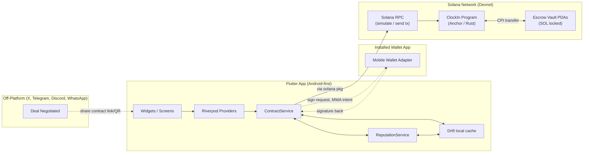
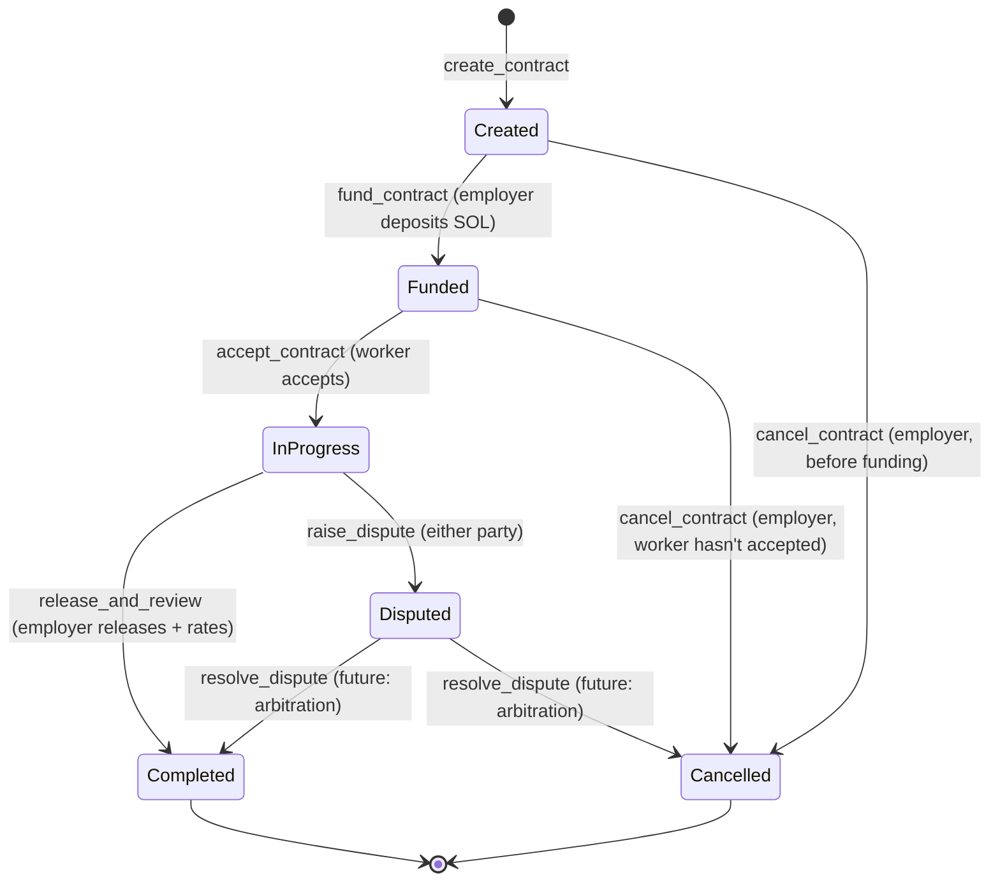

# Architecture

## Overview

ClockIn is a **P2P Work Contract & Escrow Protocol** on Solana. The core idea: freelancers find work wherever deals happen — X/Twitter DMs, Telegram groups, Discord servers, WhatsApp — then use ClockIn to formalize the agreement, lock funds in escrow, and release payment upon completion, with an atomic on-chain review generated at the moment of settlement. The app is not a marketplace or job board; it's the settlement layer for deals negotiated elsewhere.

Two components. An **Anchor program** (Rust) is the source of truth for contracts, escrow vaults, reputation data, and reviews. A **Flutter app**, Android-first, is the only client for the MVP; it reads and writes to the program via Solana RPC (through the [`solana`](https://pub.dev/packages/solana) Dart package) and signs transactions via **Mobile Wallet Adapter** (through [`solana_mobile_client`](https://pub.dev/packages/solana_mobile_client)) — the app never generates or holds a private key itself; it asks an installed wallet app to sign. There is no backend server — the program *is* the database, with a local Drift cache in front of it for offline-first UX (see the local-persistence note below).



## Core concept: Escrow-linked reputation

The key architectural insight — and the project's core novelty — is that **reviews are not a standalone action; they are atomically generated as a side effect of escrow settlement.** You cannot leave a review without having had real funds at stake. You cannot receive a review without having completed a funded contract. This makes the cost of a fake review equal to the cost of locking real SOL in escrow and completing a full contract lifecycle, which is a fundamentally stronger sybil-resistance mechanism than signature-only checks.

**Previous architecture (preserved as foundation):** `WorkerProfile` PDAs track aggregate reputation; `Review` PDAs store individual attestations. These still exist and work exactly as before — the escrow layer wraps around them, not replaces them.

## Account model

### Existing (unchanged)

- **`WorkerProfile`** — PDA seeds: `[b"worker", worker.key()]`. One per worker. Tracks `total_jobs`, `rating_sum`, `created_at`. Already deployed and tested on devnet.
- **`Review`** — PDA seeds: `[b"review", worker.key(), job_id.as_bytes()]`. One per (worker, job_id). Already deployed and tested on devnet.

### New: Escrow accounts

- **`EscrowContract`** — PDA seeds: `[b"escrow", contract_id.as_bytes()]`. One per contract. Stores the terms, parties, state machine, and payment details.

```
EscrowContract {
    contract_id: String,       // ≤32 bytes, client-generated unique ID
    employer: Pubkey,          // the party funding the escrow
    worker: Pubkey,            // the party performing the work
    amount: u64,               // lamports locked in escrow
    terms_hash: [u8; 32],      // SHA-256 of off-chain terms document (not stored on-chain)
    status: ContractStatus,    // Created | Funded | InProgress | Completed | Disputed | Cancelled
    deadline: i64,             // Unix timestamp — optional deadline for work completion
    created_at: i64,
    funded_at: i64,            // 0 if not yet funded
    completed_at: i64,         // 0 if not yet completed
    rating: u8,                // 0 until completion, 1-5 at settlement
    bump: u8,
}
```

- **Vault PDA** — PDA seeds: `[b"vault", contract_id.as_bytes()]`. A system-owned account holding the locked SOL. The program has authority over this PDA and performs CPI transfers to/from it. No custom account data — it's just a lamport holder.

### Contract status state machine



## Data flows

### 1. Contract creation & funding (employer-initiated)

1. Employer negotiates a deal off-platform (X DM, Telegram, Discord, WhatsApp — wherever deals happen naturally).
2. Employer opens ClockIn, creates a contract: specifies the worker's Solana address, payment amount, optional deadline, and a hash of any off-chain terms.
3. The `create_contract` instruction initializes the `EscrowContract` PDA. The employer then calls `fund_contract` to transfer SOL into the Vault PDA — this is the moment real money is at stake.
4. Employer shares the contract ID with the worker (via QR code, deep link, or manual paste). **The contract link is the handoff mechanism** — it replaces the old "how does the reviewer find the worker" question from the reputation-only architecture.

### 2. Contract acceptance (worker-side)

1. Worker receives the contract link/QR/ID from the employer.
2. Worker opens ClockIn, views the contract details (amount, deadline, terms hash).
3. Worker calls `accept_contract` — signed by the worker's wallet via MWA. Status moves to `InProgress`.
4. If the worker isn't already registered (`WorkerProfile` doesn't exist), `accept_contract` can atomically `register_worker` as well — one fewer transaction for new users.

### 3. Settlement: release & review (atomic)

1. Work is completed off-platform.
2. Employer opens the contract in ClockIn, rates the work (1–5), and calls `release_and_review`.
3. **In a single transaction**, the program:
   - Transfers the locked SOL from the Vault PDA to the worker's wallet.
   - Creates a `Review` PDA (same structure as before, but with `contract_id` as the `job_id`).
   - Updates the worker's `WorkerProfile` aggregates (`total_jobs += 1`, `rating_sum += rating`).
   - Sets the contract status to `Completed`.
4. **This atomicity is the core sybil-resistance mechanism.** A review cannot exist without a payment having been made. A payment cannot be made without funds having been locked. The cost of fabricating a review is the cost of actually locking and transferring real SOL.

### 4. Cancellation

1. Employer can cancel a contract and reclaim funds **only if** the worker hasn't accepted yet (status is `Created` or `Funded`).
2. Once the worker has accepted (`InProgress`), the employer cannot unilaterally cancel — this protects the worker from starting work and having the rug pulled.
3. On cancellation, SOL in the Vault PDA is returned to the employer.

### 5. Dispute (MVP-minimal)

1. Either party can raise a dispute on an `InProgress` contract, moving it to `Disputed`.
2. **MVP: disputes are recorded on-chain but not automatically resolved.** Resolution requires manual intervention (future: DAO arbitration, mediator selection). For the hackathon, the dispute mechanism exists as a state and an on-chain record, with resolution deferred to a post-MVP arbitration system.
3. The fact that disputes are on-chain and timestamped is itself valuable — it creates an immutable record of disagreement that any future arbitration system can reference.

### 6. Reputation lookup (unchanged)

1. Anyone can look up any Solana address — read-only, no signature needed.
2. `WorkerProfile` shows aggregate stats; `Review` accounts (filtered by `memcmp` on the `worker` field) show individual reviews.
3. Reviews now carry implicit weight because each one is backed by a settled escrow contract.

## Instructions summary

| Instruction | Signer | What it does |
|---|---|---|
| `register_worker` | worker | Creates `WorkerProfile` PDA. **Unchanged from current deployed program.** |
| `create_contract` | employer | Creates `EscrowContract` PDA with status `Created`. |
| `fund_contract` | employer | Transfers SOL to Vault PDA, status → `Funded`. |
| `accept_contract` | worker | Worker accepts, status → `InProgress`. Optionally auto-registers worker. |
| `release_and_review` | employer | Transfers vault SOL → worker, creates `Review`, updates `WorkerProfile`, status → `Completed`. **Atomic.** |
| `cancel_contract` | employer | Returns vault SOL → employer, status → `Cancelled`. Only if worker hasn't accepted. |
| `raise_dispute` | employer OR worker | Status → `Disputed`. Records who raised it and when. |
| `submit_review` | reviewer | Standalone review (no escrow). **Unchanged from current deployed program.** Kept for backward compatibility but expected to be deprecated in favor of escrow-linked reviews. |

> **Design decision: `create_contract` and `fund_contract` are separate instructions.** This lets an employer create a contract, share it with the worker for review, and only lock funds after the worker has seen the terms. Alternatively, `create_and_fund` could be a single instruction for the common case — decide during implementation which UX flow is better and whether to support both.

## MWA on-device findings (Phantom / Solflare)

First real on-device testing (Phantom and Solflare, both Android) surfaced two real findings worth recording so they aren't re-discovered from scratch. **Confirmed end-to-end working**: `register_worker` signed via Solflare on a physical device, landed on devnet, and independently verified by reading the transaction and the resulting `WorkerProfile` PDA back from devnet RPC directly (not just trusting the app's own UI).

**Wallets don't reliably return focus to the app after completing a local-association flow.** Confirmed this is not a ClockIn bug: `WalletAdapter`'s `connect()` and `signAndSendTransaction()` both correctly await the real result and call `scenario.close()` in a `finally` block (verified against the actual `solana_mobile_client` plugin source — the return-to-caller step is Android's own `startActivityForResult`/`onActivityResult` mechanism, which fires only when the *wallet's* activity calls `finish()`, entirely outside this app's control). Both Phantom and Solflare completed their MWA session correctly (encrypted session established, JSON‑RPC round-trip succeeds) but did not always bring ClockIn back to the foreground afterward — the user has to manually switch back. Workaround: none available from the dApp side; this is wallet-app behavior. Worth re-testing against newer wallet releases before the submission deadline in case it's fixed upstream.

**Devnet transactions were being declined — root cause was the wallet's own active-network setting.** Every `register_worker`/`submit_review` attempt on-device was getting declined. The actual cause: **the wallet app's own active-network setting (Devnet/Testnet/Mainnet, in the wallet's own Settings screen) is what actually governs simulation and submission — MWA's `authorize(cluster: ...)` parameter is advisory and does not force it.** A freshly-installed wallet defaults to Mainnet; against a devnet-only program and devnet blockhash, that produces instant declines or "blockhash expired" errors. Switching the wallet's own network setting to Devnet — no code change — was the actual fix. **Action item: the app must surface a clear, explicit "make sure your wallet is set to Devnet" instruction in the connect flow** — this is exactly the kind of setup step a judge or new user will trip over silently.

**MWA `SignedTx` requires placeholder signatures.** `SignedTx(compiledMessage: compiledMessage)` without signatures produces a transaction the wallet can't process. Must include `Signature(List.filled(64, 0), publicKey: signer)` to indicate which signature slots the wallet should fill.

## Local persistence: trust model

Drift caches on-chain state (`WorkerProfiles`, `Reviews`, `EscrowContracts`) plus `DraftReviews` for offline-composed reviews and `DraftContracts` for offline-composed contracts awaiting a connection.

**Decided: trust the cache, refresh in the background** (`ReputationRepository.getWorkerProfile`/`getWorkerReviews` serve the cached row immediately, then trigger an unawaited background refresh). The required transparency piece is in the UI: profile cards show "Synced Xm ago" reading `WorkerProfile.syncedAt`. Contract screens should show a similar sync indicator — contract state transitions (especially `Funded` → `InProgress` and `InProgress` → `Completed`) are time-sensitive and worth re-verifying from chain before acting on.

## Security / trust model

- **Sybil resistance is now escrow-linked, not just signature-based.** In the previous architecture, a review only required the reviewer's signature — one person could generate five free wallets and review "themselves" from each. Now, each escrow-linked review requires real SOL to be locked and transferred, making the cost of fabrication equal to the cost of actual payment. Standalone `submit_review` (without escrow) still exists for backward compatibility but should be clearly marked as "unverified" in the UI and weighted lower in any aggregate score.
- **Escrow safety: the Vault PDA is program-controlled.** Neither party can drain the vault outside the program's state machine. The employer can only reclaim funds if the worker hasn't accepted; the worker only receives funds when the employer explicitly releases them. This is enforced by Anchor constraints and PDA authority, not application logic.
- **Key custody is Mobile Wallet Adapter's job, not this app's.** Unlike StellarRep (which stored a Keychain-held key directly), this app never generates, imports, or stores a private key at all — every signature is an MWA round-trip to a separate wallet app the user already trusts. This is a meaningfully stronger security posture.
- **Terms are hashed, not stored.** The `terms_hash` field stores a SHA-256 of whatever off-chain terms document the parties agree to (could be a screenshot of a DM, a PDF, a text file). The actual terms never touch the blockchain — only the hash does, which is sufficient to prove that a specific document was agreed to at a specific time. This avoids putting sensitive contract details on a public ledger.
- **Network posture is devnet-only for the entire MVP build.** No mainnet program ID, no mainnet keys, anywhere in this repo, until a deliberate, separate later decision.

## Build & test toolchain

The versions below are what's actually installed and in use as of this writing — treat them as a snapshot, not a pin. Re-resolve current versions at build time rather than trusting these numbers.

| Tool | Version | Role |
|---|---|---|
| Solana CLI (Agave) | 4.2.2 | `solana` keypair/airdrop/RPC config; `solana program deploy` for devnet |
| `cargo-build-sbf` + platform-tools | 4.1.0 / v1.54 | compiles the Rust program to the deployable `reputation.so` (SBF bytecode) |
| `anchor-lang` (crate) | 1.2.0 | the program's only real dependency; pinned in `program/programs/reputation/Cargo.toml` |
| Anchor CLI | 1.2.0 (via `avm`) | intended for `anchor build` / `anchor test` / `anchor deploy` — **but see the Anchor.toml caveat below** |
| Node / npm | 26 / bundled | for `anchor test`'s TypeScript client |

**The program was scaffolded by hand, not `anchor init`.** `Anchor.toml` was added by hand so `anchor build`/`anchor test`/`anchor deploy` have a workspace to operate on.

**Testing approach: `anchor test` (TypeScript), not a Rust-native harness.** `litesvm` and `solana-program-test` both hit unresolvable dependency conflicts against the Solana 4.x split crates. The full suite (10 cases covering registration and review submission, including every failure path) passes reproducibly.

**Known-bad default build: `anchor build`/`anchor test`'s own build step must not be used as-is.** Always build the program explicitly before testing:
```bash
cd program/programs/reputation
cargo build-sbf --arch v1 --sbf-out-dir ../../target/deploy
cd ../..
anchor test --skip-build --validator legacy
```

**AVM proxy quirk.** `anchor` on `PATH` is an `avm` proxy that hangs when run outside an Anchor project. Run it from inside `program/`, or call `~/.avm/bin/anchor-1.2.0` directly.

**Toolchain drift across sessions.** Multiple Solana/Agave releases are installed on this machine. Which one is active can change between sessions — re-check `solana --version` and re-run the explicit `--arch` build step regardless.

## Non-goals for MVP

Intentionally excluded from the first working version. Each is a real candidate for a post-hackathon issue:

- **Automated dispute resolution / arbitration DAO** — disputes can be raised and recorded on-chain, but resolution is manual. Building a full arbitration system (mediator selection, evidence submission, voting) is a separate product.
- **Multi-milestone contracts** — MVP supports single-payment escrow. Phased milestones (release 30% at checkpoint 1, 70% at completion) are a natural extension but significantly more complex state management.
- **SPL token escrow** — MVP is SOL-only. Supporting USDC/USDT or other SPL tokens requires token account management and a more complex vault design.
- **On-chain terms storage** — only the hash is stored. Decentralized terms storage (IPFS/Arweave) is a future improvement.
- **Multi-marketplace aggregation** — importing/reconciling existing reputation from other platforms.
- **Reviewer reputation / weighted reviews** — weighting a review by how trustworthy the *reviewer* is.
- **Mainnet deployment and a real key-management story beyond "the user's own wallet app handles it."**
- **iOS.** Flutter scaffolds it by default; Solana Mobile Stack doesn't need it and this hackathon doesn't reward it.
- **Worker identity: display name and avatar photo.** Deliberately choosing pseudonymity for the hackathon build — identity/KYC is a different product concern from "did this person complete verified, paid work." Same reasoning applies to review comments (no text field on `Review`). Revisit both together post-hackathon.
