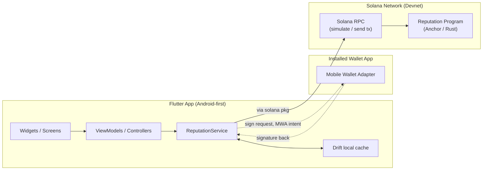

# Architecture

## Overview

Two components. An **Anchor program** (Rust) is the source of truth for reputation data — who's registered, what reviews exist, aggregate scores. A **Flutter app**, Android-first, is the only client for the MVP; it reads and writes to the program via Solana RPC (through the [`solana`](https://pub.dev/packages/solana) Dart package) and signs transactions via **Mobile Wallet Adapter** (through [`solana_mobile_client`](https://pub.dev/packages/solana_mobile_client)) — the app never generates or holds a private key itself; it asks an installed wallet app to sign. There is no backend server for reputation data itself — the program *is* the database, with a local Drift cache in front of it for offline-first UX (see the local-persistence note below). This is a deliberate simplicity choice for MVP scope, not a claim that it's the only valid design.



## Data flows

### 1. Worker registration
1. Worker opens the app; connects an installed wallet via Mobile Wallet Adapter (no key ever created or stored by this app).
2. App builds a `register_worker` instruction referencing the worker's own wallet as the signer; sends it to the wallet app via MWA for approval.
3. `ReputationService` sends the signed transaction, polls for confirmation. The UI should reflect *confirmed* state, not just "submitted" — a Solana tx can still fail after simulation succeeds, same discipline as StellarRep had for Soroban.
4. On success, the local Drift cache is updated from the confirmed on-chain account state (not just optimistically from the request).

### 2. Review submission (two-party)
1. Worker completes a job outside the app and shares a job reference with the counterparty — MVP handoff mechanism still to be decided (see `docs/APP_SPEC.md`'s Screens section; StellarRep settled on manual paste for its own MVP, worth revisiting here since Mobile Wallet Adapter and Android make deep links more natural than they were on iOS).
2. Reviewer opens the app, enters the worker's address + job reference, picks a rating.
3. The reviewer's *own* wallet signs the `submit_review` instruction via MWA — this is the sybil-resistance anchor for MVP: the program requires the *reviewer's* signature, not the worker's, so a worker can't self-review, and a given job reference can only be used once per worker (program-enforced — see `docs/PROGRAM_SPEC.md`).
4. Both parties' local caches refresh from the confirmed on-chain state.

### 3. Reputation lookup
1. Anyone can enter a Solana address — this is a read, no signature involved.
2. App fetches the worker's reputation account via Solana RPC — no transaction, no fee, no wallet interaction required for reads.
3. Local Drift cache serves this instantly if already synced, then refreshes from chain — see the trust/re-verification note below.

## Local persistence: trust model

Drift caches on-chain state (`WorkerProfiles`, `Reviews`) plus `DraftReviews` for offline-composed reviews awaiting a connection. Decide early (by the time `ReputationService` is wired up — Phase 5 in `docs/ROADMAP.md`) how this cache is treated:
- **Read-through, always re-verify before showing a number that matters** (e.g. right before a reviewer submits, or the first time a profile is opened) — safer, more RPC calls.
- **Trust the cache for casual browsing, only re-verify on explicit refresh or before a write** — faster/more offline-friendly, small window where a stale number is shown.

Whichever is chosen, be explicit about it in the UI (a "last synced" timestamp, minimum) — the whole point of on-chain reputation is that it's trustworthy; a UI that silently shows stale cached data as if it were live undermines that.

## Security / trust model

- **Sybil resistance is signature-based for MVP, not stake-based.** A review only counts if it's signed by an address distinct from the worker's, tied to a unique job reference. This blocks the most trivial attack (self-review) but does **not** block collusion between two real accounts fabricating a fake job — that's a genuinely harder problem, explicitly out of scope for MVP (see Non-goals). Be direct about this limitation in the README rather than implying the MVP fully solves review fraud.
- **Key custody is Mobile Wallet Adapter's job, not this app's.** Unlike StellarRep (which stored a Keychain-held key directly), this app never generates, imports, or stores a private key at all — every signature is an MWA round-trip to a separate wallet app the user already trusts. This is a meaningfully stronger security posture, and worth stating clearly in the README as a differentiator, not just an implementation detail.
- **Network posture is devnet-only for the entire MVP build.** No mainnet program ID, no mainnet keys, anywhere in this repo, until a deliberate, separate later decision — see `CLAUDE.md`'s ground rules.

## Build & test toolchain

The versions below are what's actually installed and in use as of this writing — treat them as a snapshot, not a pin. Ground rule 2 in `CLAUDE.md` still applies: re-resolve current versions at build time rather than trusting these numbers.

| Tool | Version | Role |
|---|---|---|
| Solana CLI (Agave) | 4.2.2 | `solana` keypair/airdrop/RPC config; `solana program deploy` for devnet |
| `cargo-build-sbf` + platform-tools | 4.1.0 / v1.54 | compiles the Rust program to the deployable `reputation.so` (SBF bytecode). Downloaded ~1.3 GB into `~/.cache/solana` on first use. |
| `anchor-lang` (crate) | 1.2.0 | the program's only real dependency; pinned in `program/programs/reputation/Cargo.toml` |
| Anchor CLI | 1.2.0 (via `avm`) | intended for `anchor build` / `anchor test` / `anchor deploy` — **but see the Anchor.toml caveat below** |
| Node / npm | 26 / bundled | for `anchor test`'s TypeScript client (no yarn/pnpm present) |

**The program was scaffolded by hand, not `anchor init`** — a plain Cargo workspace under `program/` with `anchor-lang` as a dependency. `Anchor.toml` has since been added by hand (see `program/Anchor.toml`'s header comment) so `anchor build`/`anchor test`/`anchor deploy` have a workspace to operate on; it points `[programs.localnet]`/`[programs.devnet]` at the real program ID and uses `[scripts] test` to run the TS suite via `ts-mocha`.

**Testing approach: `anchor test` (TypeScript), not a Rust-native harness.** `litesvm` and `solana-program-test` were both tried first and both hit unresolvable dependency conflicts against the Solana 4.x split crates that `anchor-lang` 1.2 pulls (`solana-inflation`, `solana-short-vec` version mismatches). Rather than fight crate-version resolution, tests run through `anchor test` — a local validator plus a TS client via `@coral-xyz/anchor`. The full suite (`program/tests/reputation.ts`, 10 cases covering both registration and review submission, including every failure path) passes reproducibly. Local validator selection: pass `--validator legacy` — this Anchor CLI's default (`surfpool`) isn't installed here.

**Known-bad default build: `anchor build`/`anchor test`'s own build step must not be used as-is.** This environment has multiple Solana/Agave toolchain releases installed side by side (`~/.local/share/solana/install/releases/`), and Anchor 1.2's internal `cargo build-sbf` invocation passes its own implicit `--arch` default that — against the toolchain currently active here — produces an ELF (`e_machine` tag mismatched against what this validator's loader accepts) that deploys "successfully" via genesis clone but is silently unexecutable: every instruction invocation fails with `"Program is not deployed" / "Unsupported program id"`, even though `solana program show`/`account` both report the account as `executable: true` with a correct owner. This is **not** a code, PDA, or test-logic bug — it reproduces identically with a hand-built raw instruction sent straight to a bare `solana-test-validator`, no Anchor or TS code involved at all. `solana program deploy` (a real deploy transaction, not genesis clone) surfaces the real cause immediately: `Error: ELF error: Failed to parse ELF file: invalid file header`.

  **The fix — always build the program explicitly before testing, bypassing Anchor's own build step:**
  ```bash
  cd program/programs/reputation
  cargo build-sbf --arch v1 --sbf-out-dir ../../target/deploy
  cd ../..
  anchor test --skip-build --validator legacy
  ```
  `--arch v0` and `--arch v2` were also confirmed to deploy correctly (only `v3` fails to build at all in this environment) — `v1` is just the one in active use. Passing `--arch` a second time via `anchor test -- --arch v1` does **not** work (`anchor build` already passes its own `--arch`, and cargo-build-sbf rejects the flag twice) — the only reliable fix is the manual pre-build shown above. Since `target/` is gitignored, `target/deploy/reputation-keypair.json` must be present (copied from `program/reputation-keypair.json`, see `Anchor.toml`'s header comment) before `cargo build-sbf` runs, or the build regenerates a fresh keypair with a new program ID that won't match `declare_id!`.

**AVM proxy quirk.** `anchor` on `PATH` is an `avm` proxy that resolves the version from project context; it hangs when run outside an Anchor project (or with flaky network — it does update checks). Run it from inside `program/`, or call `~/.avm/bin/anchor-1.2.0` directly.

**Toolchain drift across sessions.** Multiple Solana/Agave releases are installed on this machine (seen so far: solana-cli 3.1.10 with platform-tools v1.52, and 4.2.2 with platform-tools v1.54, selected via the `~/.local/share/solana/install/active_release` symlink). Which one is active can and does change between sessions — don't assume the table above still matches `solana --version`'s actual output; re-check it, and re-run the explicit `--arch` build step above regardless of which release is active, since that's what actually matters for a working local test run.

## Non-goals for MVP

Intentionally excluded from the first working version — not because they're unimportant, but because trying to ship all of them at once is how MVPs stall. Each is a real candidate for a GitHub issue once the core loop works, so other hackathon-adjacent contributors (or future you) have something concrete to pick up:

- **Dispute resolution / review retraction** — a bad-faith review, once submitted, is permanent.
- **Stake-weighted or escrow-linked reviews** — requiring a real on-chain payment reference before a review counts would meaningfully raise the cost of fake reviews, but is materially bigger scope.
- **Multi-marketplace aggregation** — importing/reconciling existing reputation from other platforms.
- **Reviewer reputation** — weighting a review by how trustworthy the *reviewer* is, not just the worker.
- **Mainnet deployment and a real key-management story beyond "the user's own wallet app handles it."**
- **iOS.** Flutter scaffolds it by default; Solana Mobile Stack doesn't need it and this hackathon doesn't reward it. Don't spend effort here.
