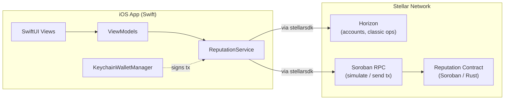

# Architecture

## Overview

Two components. A **Soroban smart contract** (Rust) is the source of truth for reputation data — who's registered, what reviews exist, aggregate scores. A **native iOS app** (Swift) is the only client for the MVP; it reads and writes to the contract via Stellar's Horizon (classic account/network data) and Soroban RPC (contract simulate/invoke), both through the `stellar-ios-mac-sdk`. There is no backend server and no off-chain database for reputation data itself — the contract *is* the database. This is a deliberate simplicity choice for MVP scope, not a claim that it's the only valid design.

## Data flows

### 1. Worker registration
1. Worker opens the app, already has (or creates via onboarding) a Stellar testnet account through `KeychainWalletManager`.
2. App calls `register_worker(worker_address)` — this is the worker's own transaction, signed by the worker.
3. `ReputationService` builds the invocation, simulates it (confirms it'll succeed and gets the resource footprint), signs with the worker's key, submits, and polls for confirmation. The UI should reflect *confirmed* state, not just "submitted" — Soroban transactions can still fail after simulation succeeds.
4. On success the contract emits `WorkerRegistered`; the app updates local state from the confirmed result.

### 2. Review submission (two-party)
1. Worker completes a job outside the app (in whatever marketplace context) and shares a `job_id` reference with the counterparty — MVP mechanism: the worker displays a QR code or copyable string encoding their address + a `job_id`. See `docs/APP_SPEC.md` / Phase 6 for the exact handoff choice.
2. Reviewer opens the app, scans or enters the worker's address + `job_id`, picks a rating.
3. The reviewer's own key signs `submit_review(worker, reviewer, job_id, rating)`. This is the sybil-resistance anchor for MVP: the contract requires the *reviewer's* signature (not the worker's), so a worker can't self-review, and a given `job_id` can only be used once per worker (contract-enforced — see `CONTRACT_SPEC.md`).
4. Contract emits `ReviewSubmitted`; both parties can refresh their view of the worker's reputation.

### 3. Reputation lookup
1. Anyone can enter or scan a Stellar address — this is a read, no authentication or signature involved.
2. App calls `get_reputation(address)` via a simulate-only Soroban RPC call — no transaction, no fee, no signature required for reads.
3. Renders aggregate score and job count; `get_reviews` (paginated) fetches the full history if the user drills in.

## Security / trust model

- **Sybil resistance is signature-based for MVP, not stake-based.** A review only counts if it's signed by an address distinct from the worker's, tied to a unique `job_id`. This blocks the most trivial attack (self-review) but does **not** block collusion between two real accounts fabricating a fake job — that's a genuinely harder problem, explicitly out of scope for MVP (see Non-goals). Be direct about this limitation in the README rather than implying the MVP fully solves review fraud — Wave reviewers and future contributors will find the gap either way, and it's better documented than discovered.
- **Key custody is on-device only.** Keychain storage, never transmitted, never touched by any backend — there is no backend. The app never sees or stores any key but the current device's own.
- **Network posture is testnet-only for the entire MVP build.** No mainnet contract ID, no mainnet secret key, anywhere in this repo, until a deliberate, separate later decision — see `CLAUDE.md`'s ground rules.

## Non-goals for MVP

These are intentionally excluded from the first working version — not because they're unimportant, but because trying to ship all of them at once is how MVPs stall. Each should become a real GitHub issue in Phase 7 so other Wave contributors have something concrete to pick up:

- **Dispute resolution / review retraction** — right now a bad-faith review, once submitted, is permanent.
- **Stake-weighted or escrow-linked reviews** — requiring a real on-chain payment reference before a review counts would meaningfully raise the cost of fake reviews, but is a materially bigger scope (probably wants integration with an actual escrow contract, e.g. cross-referencing something like Trustless-Work).
- **Multi-marketplace aggregation** — importing/reconciling existing reputation from other platforms (OFFER-HUB, etc.).
- **Reviewer reputation** — weighting a review by how trustworthy the *reviewer* is, not just the worker.
- **Mainnet deployment and a production key-management strategy** — Keychain-only, single-device custody is fine for an MVP demo; it is not a real answer for production fund-adjacent identity data.
