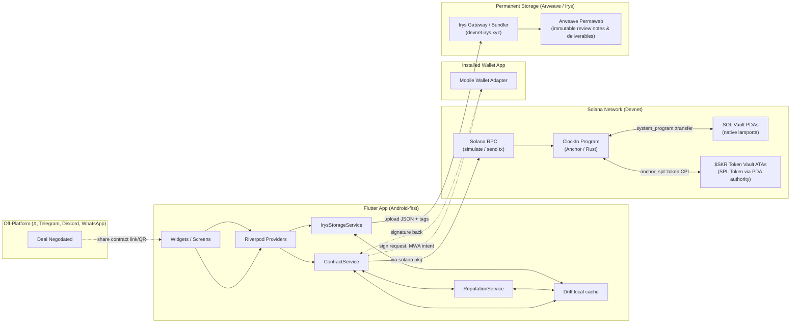
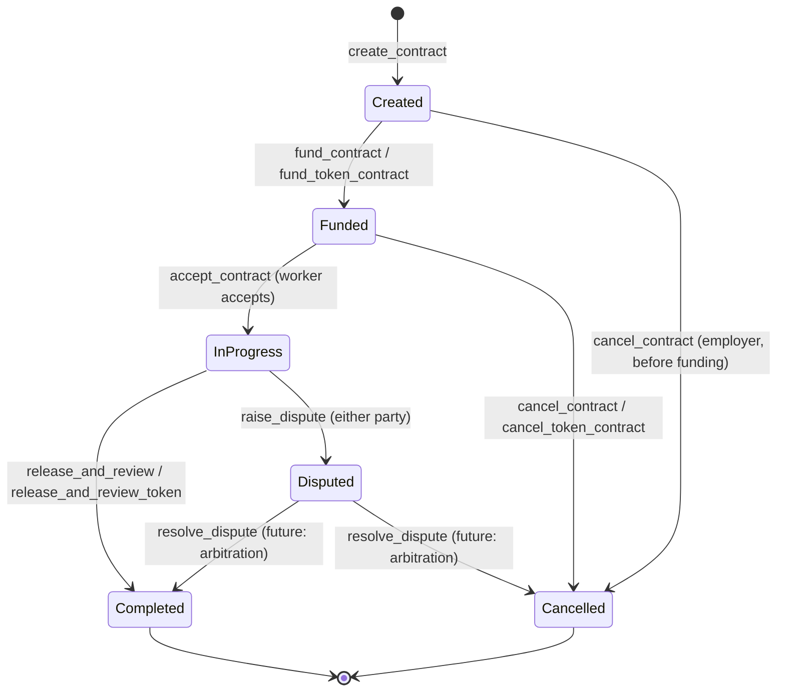

# Architecture

## Overview

ClockIn is a **P2P Work Contract & Escrow Protocol** on Solana. The core idea: freelancers find work wherever deals happen — X/Twitter DMs, Telegram groups, Discord servers, WhatsApp — then use ClockIn to formalize the agreement, lock funds in escrow, and release payment upon completion, with an atomic on-chain review generated at the moment of settlement. The app is not a marketplace or job board; it's the settlement layer for deals negotiated elsewhere.

Two components. An **Anchor program** (Rust) is the source of truth for contracts, escrow vaults, reputation data, and reviews. A **Flutter app**, Android-first, is the only client for the MVP; it reads and writes to the program via Solana RPC (through the [`solana`](https://pub.dev/packages/solana) Dart package) and signs transactions via **Mobile Wallet Adapter** (through [`solana_mobile_client`](https://pub.dev/packages/solana_mobile_client)) — the app never generates or holds a private key itself; it asks an installed wallet app to sign. There is no backend server — the program *is* the database, with a local Drift cache in front of it for offline-first UX (see the local-persistence note below).


```mermaid
flowchart LR
    subgraph ext["Off-Platform (X, Telegram, Discord, WhatsApp)"]
        DEAL["Deal Negotiated"]
    end
    subgraph app["Flutter App (Android-first)"]
        UI["Widgets / Screens"]
        VM["Riverpod Providers"]
        CS["ContractService"]
        RS["ReputationService"]
        IS["IrysStorageService"]
        DB["Drift local cache"]
    end
    subgraph wallet["Installed Wallet App"]
        MWA["Mobile Wallet Adapter"]
    end
    subgraph net["Solana Network (Devnet)"]
        RPC["Solana RPC\n(simulate / send tx)"]
        PROG["ClockIn Program\n(Anchor / Rust)"]
        VAULT_SOL["SOL Vault PDAs\n(native lamports)"]
        VAULT_SKR["$SKR Token Vault ATAs\n(SPL Token via PDA authority)"]
    end
    subgraph perma["Permanent Storage (Arweave / Irys)"]
        IRYS["Irys Gateway / Bundler\n(devnet.irys.xyz)"]
        ARW["Arweave Permaweb\n(immutable review notes & deliverables)"]
    end
    DEAL -.->|share contract link/QR| UI
    UI --> VM --> CS
    UI --> VM --> IS
    CS <--> RS
    CS <--> DB
    RS <--> DB
    IS <--> DB
    IS -->|upload JSON + tags| IRYS --> ARW
    CS -->|via solana pkg| RPC --> PROG
    PROG <-->|system_program::transfer| VAULT_SOL
    PROG <-->|anchor_spl::token CPI| VAULT_SKR
    CS -.->|sign request, MWA intent| MWA
    MWA -.->|signature back| CS
```

## Core concept: Escrow-linked reputation

The key architectural insight — and the project's core novelty — is that **reviews are not a standalone action; they are atomically generated as a side effect of escrow settlement.** You cannot leave a review without having had real funds at stake. You cannot receive a review without having completed a funded contract. This makes the cost of a fake review equal to the cost of locking real SOL in escrow and completing a full contract lifecycle, which is a fundamentally stronger sybil-resistance mechanism than signature-only checks.

**Previous architecture (preserved as foundation):** `WorkerProfile` PDAs track aggregate reputation; `Review` PDAs store individual attestations. These still exist and work exactly as before — the escrow layer wraps around them, not replaces them.

## Account model

### Existing (unchanged)

- **`WorkerProfile`** — PDA seeds: `[b"worker", worker.key()]`. One per worker. Tracks `total_jobs`, `rating_sum`, `created_at`. Already deployed and tested on devnet.
- **`Review`** — PDA seeds: `[b"review", worker.key(), job_id.as_bytes()]`. One per (worker, job_id). Already deployed and tested on devnet.

### New: Escrow accounts

- **`EscrowContract`** — PDA seeds: `[b"escrow", contract_id.as_bytes()]`. One per contract. Stores the terms, parties, state machine, and payment details. Supports both native SOL and SPL Token ($SKR) denominations.

```
EscrowContract {
    contract_id: String,       // ≤32 bytes, client-generated unique ID
    employer: Pubkey,          // the party funding the escrow
    worker: Pubkey,            // the party performing the work
    amount: u64,               // lamports (SOL) or base units ($SKR) locked in escrow
    terms_hash: [u8; 32],      // SHA-256 of off-chain terms document (not stored on-chain)
    status: ContractStatus,    // Created | Funded | InProgress | Completed | Disputed | Cancelled
    deadline: i64,             // Unix timestamp — optional deadline for work completion
    created_at: i64,
    funded_at: i64,            // 0 if not yet funded
    completed_at: i64,         // 0 if not yet completed
    rating: u8,                // 0 until completion, 1-5 at settlement
    bump: u8,
    vault_bump: u8,
    // --- $SKR Token Support ---
    is_token: bool,            // false = native SOL escrow, true = SPL Token escrow
    token_mint: Pubkey,        // Pubkey::default() if SOL, $SKR mint address if token
}
```

- **SOL Vault PDA** — PDA seeds: `[b"vault", contract_id.as_bytes()]`. A system-owned account holding locked native SOL lamports. Used when `is_token == false`.

- **`DisputeCase`** — PDA seeds: `[b"dispute_case", contract_id.as_bytes()]`. Created only when a dispute escalates to juror arbitration. Stores `jurors: [Pubkey; 3]`, `votes: [u8; 3]`, the tallied `quorum_outcome`, a `DisputeCaseStatus` (`Voting` / `QuorumReached` / `Executed`), and `created_at` / `resolved_at` timestamps.

- **Token Vault ATA** — An Associated Token Account (ATA) whose owner/authority is the Vault PDA. Holds locked $SKR tokens. The program signs token transfers via PDA seeds `[b"vault", contract_id.as_bytes(), &[vault_bump]]`. Used when `is_token == true`. Created and closed alongside the contract lifecycle.

### Contract status state machine

The state machine is identical for both SOL and $SKR contracts. The only difference is which CPI mechanism moves funds: `system_program::transfer` for SOL, `anchor_spl::token::transfer` for $SKR.


```mermaid
stateDiagram-v2
    [*] --> Created: create_contract
    Created --> Funded: fund_contract / fund_token_contract
    Funded --> InProgress: accept_contract (worker accepts)
    InProgress --> Completed: release_and_review / release_and_review_token
    InProgress --> Disputed: raise_dispute (either party)
    Created --> Cancelled: cancel_contract (employer, before funding)
    Funded --> Cancelled: cancel_contract / cancel_token_contract
    Completed --> [*]
    Cancelled --> [*]
    Disputed --> Completed: resolve_dispute (future: arbitration)
    Disputed --> Cancelled: resolve_dispute (future: arbitration)
```

## Data flows

### 1. Contract creation & funding (employer-initiated)

1. Employer negotiates a deal off-platform (X DM, Telegram, Discord, WhatsApp — wherever deals happen naturally).
2. Employer opens ClockIn, creates a contract: specifies the worker's Solana address, payment amount, optional deadline, and a hash of any off-chain terms.
3. The `create_contract` instruction initializes the `EscrowContract` PDA. The employer then calls `fund_contract` to transfer SOL into the Vault PDA — this is the moment real money is at stake.
4. Employer shares the contract ID with the worker (via QR code, deep link, or manual paste). **The contract link is the handoff mechanism** — it replaces the old "how does the reviewer find the worker" question from the reputation-only architecture.

### 2. Contract acceptance (worker-side)

1. Worker receives the contract link/QR/ID from the employer.
2. Worker opens ClockIn, views the contract details (amount, deadline, terms hash).
3. Worker calls `accept_contract` — signed by the worker's wallet via MWA. Status moves to `InProgress`.
4. If the worker isn't already registered (`WorkerProfile` doesn't exist), `accept_contract` can atomically `register_worker` as well — one fewer transaction for new users.

### 3. Settlement: release & review (atomic)

1. Work is completed off-platform.
2. Employer opens the contract in ClockIn, rates the work (1–5), and calls `release_and_review`.
3. **In a single transaction**, the program:
   - Transfers the locked SOL from the Vault PDA to the worker's wallet.
   - Creates a `Review` PDA (same structure as before, but with `contract_id` as the `job_id`).
   - Updates the worker's `WorkerProfile` aggregates (`total_jobs += 1`, `rating_sum += rating`).
   - Sets the contract status to `Completed`.
4. **This atomicity is the core sybil-resistance mechanism.** A review cannot exist without a payment having been made. A payment cannot be made without funds having been locked. The cost of fabricating a review is the cost of actually locking and transferring real SOL.

### 4. Cancellation

1. Employer can cancel a contract and reclaim funds **only if** the worker hasn't accepted yet (status is `Created` or `Funded`).
2. Once the worker has accepted (`InProgress`), the employer cannot unilaterally cancel — this protects the worker from starting work and having the rug pulled.
3. On cancellation, SOL in the Vault PDA is returned to the employer.

### 5. Dispute resolution

1. Either party can raise a dispute on an `InProgress` contract, moving it to `Disputed`. Vault funds stay locked.
2. **Direct resolution.** Either party may call `resolve_dispute` (SOL) or `resolve_token_dispute` ($SKR) with one of three outcomes: `ReleaseToWorker`, `RefundToEmployer`, or a 50/50 `Split`. This is the fast path for a dispute the parties settle between themselves.
3. **Juror arbitration.** For disputes the parties will not settle, `initialize_dispute_case` opens a `DisputeCase` PDA (seeds `[b"dispute_case", contract_id]`) naming exactly three distinct jurors. The program rejects a juror set containing the employer or the worker, so neither party can sit on their own case.
4. Each juror calls `cast_juror_vote` once (`Release` / `Refund` / `Split`). Votes are recorded per juror index, and double-voting is rejected. The program tallies after every vote and flips the case to `QuorumReached` as soon as any outcome holds a 2-of-3 majority, recording `quorum_outcome` and `resolved_at`.
5. `execute_dispute_ruling` (SOL) / `execute_token_dispute_ruling` ($SKR) then moves the vault funds according to the recorded quorum outcome and settles the contract. Execution is guarded so a case can only be executed once, and only after quorum.
6. Disputes being on-chain and timestamped remains valuable in itself — an immutable record of disagreement, independent of how it was resolved.

**Still out of scope:** how jurors are *chosen*. The caller supplies the three pubkeys; there is no election, staking bond, random sampling, or slashing for bad verdicts. That governance layer is the real remaining work before this is trustworthy with strangers' money.

### 6. Reputation lookup (unchanged)

1. Anyone can look up any Solana address — read-only, no signature needed.
2. `WorkerProfile` shows aggregate stats; `Review` accounts (filtered by `memcmp` on the `worker` field) show individual reviews.
3. Reviews now carry implicit weight because each one is backed by a settled escrow contract.

## Instructions summary

### Native SOL Escrow Instructions

| Instruction | Signer | What it does |
|---|---|---|
| `register_worker` | worker | Creates `WorkerProfile` PDA. **Unchanged from current deployed program.** |
| `create_contract` | employer | Creates `EscrowContract` PDA with status `Created`. Sets `is_token = false`. |
| `fund_contract` | employer | Transfers SOL to Vault PDA, status → `Funded`. |
| `create_and_fund` | employer | Convenience: creates and funds in a single transaction. |
| `accept_contract` | worker | Worker accepts, status → `InProgress`. Works for both SOL and token contracts. |
| `release_and_review` | employer | Transfers vault SOL → worker, creates `Review`, updates `WorkerProfile`, status → `Completed`. **Atomic.** |
| `cancel_contract` | employer | Returns vault SOL → employer, status → `Cancelled`. Only if worker hasn't accepted. |
| `raise_dispute` | employer OR worker | Status → `Disputed`. Works for both SOL and token contracts. |
| `submit_review` | reviewer | Standalone review (no escrow). **Unchanged from current deployed program.** Kept for backward compatibility but expected to be deprecated in favor of escrow-linked reviews. |

### $SKR Token Escrow Instructions (Dedicated, Parallel)

These instructions mirror the SOL escrow lifecycle but use SPL Token CPI (`anchor_spl::token`) instead of `system_program::transfer`. They leave the existing SOL instructions completely untouched — zero regression risk.

| Instruction | Signer | What it does |
|---|---|---|
| `create_and_fund_token` | employer | Creates `EscrowContract` PDA with `is_token = true` and `token_mint = $SKR mint`. Initializes a Vault Token ATA owned by the Vault PDA. Transfers `amount` of $SKR from employer's ATA → vault ATA via SPL Token CPI. Status → `Funded`. |
| `release_and_review_token` | employer | Vault PDA signs via seeds to transfer $SKR from vault ATA → worker ATA. Closes vault ATA (rent → employer). Creates `Review` PDA, updates `WorkerProfile`. Status → `Completed`. **Atomic.** |
| `cancel_token_contract` | employer | Returns $SKR from vault ATA → employer ATA. Closes vault ATA. Status → `Cancelled`. Only if worker hasn't accepted. |

### Dispute Resolution Instructions

Two tiers: either party can settle a dispute directly, or a three-juror quorum can rule on it. Both tiers have a SOL and a $SKR variant. See the "Dispute resolution" data flow above.

| Instruction | Signer | What it does |
|---|---|---|
| `resolve_dispute` | employer OR worker | Settles a `Disputed` SOL contract directly with outcome `ReleaseToWorker`, `RefundToEmployer`, or 50/50 `Split`. |
| `resolve_token_dispute` | employer OR worker | Same, for a $SKR contract, moving tokens via SPL Token CPI. |
| `initialize_dispute_case` | either party | Opens a `DisputeCase` PDA (`[b"dispute_case", contract_id]`) naming three distinct jurors. Rejects any juror set containing the employer or worker. |
| `cast_juror_vote` | assigned juror | Records one juror's vote (`Release` / `Refund` / `Split`). Rejects non-jurors and double votes. Flips the case to `QuorumReached` on a 2-of-3 majority. |
| `execute_dispute_ruling` | any | Executes the recorded quorum outcome against a SOL vault and settles the contract. Only after quorum, only once. |
| `execute_token_dispute_ruling` | any | Same, for a $SKR vault ATA. |

> **Design decision: `create_contract` and `fund_contract` are separate instructions.** This lets an employer create a contract, share it with the worker for review, and only lock funds after the worker has seen the terms. Alternatively, `create_and_fund` could be a single instruction for the common case — decide during implementation which UX flow is better and whether to support both.

## MWA on-device findings (Phantom / Solflare)

First real on-device testing (Phantom and Solflare, both Android) surfaced two real findings worth recording so they aren't re-discovered from scratch. **Confirmed end-to-end working**: `register_worker` signed via Solflare on a physical device, landed on devnet, and independently verified by reading the transaction and the resulting `WorkerProfile` PDA back from devnet RPC directly (not just trusting the app's own UI).

**Wallets don't reliably return focus to the app after completing a local-association flow.** Confirmed this is not a ClockIn bug: `WalletAdapter`'s `connect()` and `signAndSendTransaction()` both correctly await the real result and call `scenario.close()` in a `finally` block (verified against the actual `solana_mobile_client` plugin source — the return-to-caller step is Android's own `startActivityForResult`/`onActivityResult` mechanism, which fires only when the *wallet's* activity calls `finish()`, entirely outside this app's control). Both Phantom and Solflare completed their MWA session correctly (encrypted session established, JSON‑RPC round-trip succeeds) but did not always bring ClockIn back to the foreground afterward — the user has to manually switch back. Workaround: none available from the dApp side; this is wallet-app behavior. Worth re-testing against newer wallet releases before the submission deadline in case it's fixed upstream.

**Devnet transactions were being declined — root cause was the wallet's own active-network setting.** Every `register_worker`/`submit_review` attempt on-device was getting declined. The actual cause: **the wallet app's own active-network setting (Devnet/Testnet/Mainnet, in the wallet's own Settings screen) is what actually governs simulation and submission — MWA's `authorize(cluster: ...)` parameter is advisory and does not force it.** A freshly-installed wallet defaults to Mainnet; against a devnet-only program and devnet blockhash, that produces instant declines or "blockhash expired" errors. Switching the wallet's own network setting to Devnet — no code change — was the actual fix. **Action item: the app must surface a clear, explicit "make sure your wallet is set to Devnet" instruction in the connect flow** — this is exactly the kind of setup step a judge or new user will trip over silently.

**MWA `SignedTx` requires placeholder signatures.** `SignedTx(compiledMessage: compiledMessage)` without signatures produces a transaction the wallet can't process. Must include `Signature(List.filled(64, 0), publicKey: signer)` to indicate which signature slots the wallet should fill.

## Local persistence: trust model

Drift caches on-chain state (`WorkerProfiles`, `Reviews`, `EscrowContracts`) plus `DraftReviews` for offline-composed reviews and `DraftContracts` for offline-composed contracts awaiting a connection.

**Decided: trust the cache, refresh in the background** (`ReputationRepository.getWorkerProfile`/`getWorkerReviews` serve the cached row immediately, then trigger an unawaited background refresh). The required transparency piece is in the UI: profile cards show "Synced Xm ago" reading `WorkerProfile.syncedAt`. Contract screens should show a similar sync indicator — contract state transitions (especially `Funded` → `InProgress` and `InProgress` → `Completed`) are time-sensitive and worth re-verifying from chain before acting on.

## Permanent Review & Deliverables Storage (Arweave / Irys)

Solana L1 excels at high-throughput state machines, deterministic escrow vaults, and fast mathematical reputation updates. However, storing long-form qualitative review feedback, deliverable attachments, work evidence, and contract terms documents directly on Solana accounts is cost-prohibitive due to ongoing account rent (~0.00089 SOL per KB).

ClockIn adopts a **hybrid decentralized architecture**:
1. **Solana L1 (Anchor)**: Holds the authoritative escrow state, financial transfers, Sybil-proof numerical rating ($1-5★$), aggregate trust score calculations, and cryptographic verification pointers.
2. **Arweave via Irys**: Holds the permanent, tamper-proof qualitative metadata (written review feedback, category scores, milestone deliverable links, proof-of-work hashes, and dispute evidence).

### Why Irys for Arweave Storage?

- **Native Solana Support**: Irys allows paying for permanent Arweave permaweb storage directly using SOL (or Devnet SOL), enabling unified payments without acquiring AR tokens.
- **Sub-Second Receipts**: Instant upload confirmations and deterministic transaction IDs without waiting for Arweave block mining.
- **Tag-Based Provenance Indexing**: Every payload is inscribed with standard metadata tags (`App-Name`, `Type`, `Worker`, `Job-Id`), allowing direct decentralized retrieval via Irys GraphQL queries without dedicated web servers.
- **Zero-Storage-Cost Free Tier for Mobile**: Uploads under 100 KB on Irys are gasless on devnet and sub-cent on mainnet, enabling sponsored or friction-free mobile review submissions.

### Review Metadata Standard (`ClockInReviewPayload`)

When an employer submits a review or completes escrow settlement, the app serializes a canonical JSON document uploaded to Irys:

```json
{
  "$schema": "https://clockin.protocol/schemas/review-v1.json",
  "protocol": "ClockIn",
  "version": "1.0.0",
  "jobId": "ctr-985669",
  "contractId": "ctr-985669",
  "worker": "4ojAkcXs48y2M8xLXYNkG5ULw4rabNT8o9P...",
  "reviewer": "6Z2qZfW7GqFv3qNf4K8jY1u9m6oP4s7T2wX1...",
  "rating": 5,
  "categoryRatings": {
    "quality": 5,
    "communication": 5,
    "timeliness": 5
  },
  "reviewNote": "Outstanding developer. Delivered production Anchor escrow program and Flutter integration 2 days ahead of schedule.",
  "deliverables": [
    {
      "title": "GitHub Pull Request",
      "uri": "https://github.com/project/core/pull/42",
      "hash": "e7d06573b4..."
    }
  ],
  "timestamp": 1727885000,
  "escrowSettled": true,
  "clientSignature": "3xY8..."
}
```

### Irys Bundling & Indexing Protocol

The upload is dispatched to `https://devnet.irys.xyz/tx/solana` (or mainnet gateway) with cryptographic tags:

| Tag Name | Value | Purpose |
|---|---|---|
| `App-Name` | `ClockIn` | Protocol namespace |
| `Content-Type` | `application/json` | Media payload descriptor |
| `Type` | `Reputation-Review` | Schema differentiator |
| `Worker` | `<worker_solana_pubkey>` | Enables worker-wide review retrieval via GraphQL |
| `Reviewer` | `<reviewer_solana_pubkey>` | Author identity |
| `Job-Id` | `<job_id>` | Deterministic linkage to Solana `Review` PDA |

### Discovery & Retrieval Architecture

Clients discover and display full review feedback using a two-stage read pattern:

1. **Fast Anchor PDA Read**: The Flutter client fetches the worker's `WorkerProfile` and `Review` accounts from Solana RPC to compute the verified on-chain score and list completed jobs.
2. **Decentralized GraphQL / Gateway Read**: The app queries Irys GraphQL by worker address (`tags: [{name: "Worker", values: [workerPubkey]}]`) or resolves directly via `https://gateway.irys.xyz/<arweave_id>`.
3. **Local Drift Storage & Offline Resilience**: Retrieved review text is cached in Drift (`LocalReviews` table). When creating a review offline, the draft is stored in `ReviewDrafts`; once connectivity returns, the payload is published to Irys, and the resulting Arweave ID is linked to the Solana MWA transaction.

## Seeker attestation (real $SKR Guardian stake)

A wallet is **Seeker Attested** when it has **≥ 250 $SKR actively staked** with a Solana Mobile Guardian. Users stake through Solana Mobile's own flow — [stake.solanamobile.com](https://stake.solanamobile.com) or Seed Vault Wallet. ClockIn only *reads* the result; it never signs, stakes, unstakes, or holds tokens. Implementation: `app/lib/core/solana/skr_staking.dart` (reader), `app/lib/core/database/attestation_repository.dart` (threshold, cache, failure policy).

This replaced an earlier implementation that set `isAttested: true` locally on a button press without reading any chain state, and a dormant `stakeSkrToGuardian` that would have transferred $SKR into a ClockIn-owned PDA with no withdrawal instruction (permanently locking it). Both were removed.

### Where the constants come from

Solana Mobile publishes neither an IDL nor an account layout for the staking program. Everything below was recovered and verified against the live chain on 2026-10-06:

| | Mainnet | Devnet |
|---|---|---|
| Staking program | `SKRskrmtL83pcL4YqLWt6iPefDqwXQWHSw9S9vz94BZ` | `HC5a2WahqscUXB61JVUCjhzAbr8NebKWVWSXEJnVBjAF` |
| $SKR mint | `SKRbvo6Gf7GondiT3BbTfuRDPqLWei4j2Qy2NPGZhW3` | `Gn72vA2mZWDhP2WQh91Tud9hh3AC3zy2Wyu2nmqfEwY9` |
| Solana Mobile Guardian | `SKRGdBwzb1AtFW2chhBnZpGFnFLj6Mi7HM7iwjXALvw` | `7fLs8CKVvv8Dd5VRMhYakr8JEoNBivKZBwpXj7mMfoLy` |

- **Program IDs, mints, guardians:** from the staking site's own frontend bundle, which carries a config object for each cluster.
- **Account types:** Anchor discriminators — `sha256("account:StakeConfig")[:8]` and `sha256("account:UserStake")[:8]` match the on-chain accounts.
- **PDA seeds:** recovered from the bump stored in real accounts, then confirmed against four real mainnet stakers (the derived `UserStake` is exactly the account their staking transaction wrote):
  - `StakeConfig = ["stake_config"]`
  - `GuardianPool = ["guardian_pool", stake_config, guardian]`
  - `UserStake = ["user_stake", stake_config, user, guardian_pool]`
- **Amount formula — `active = shares × share_price / 1e9`:** on devnet the sum of every user's `shares` equals `StakeConfig.total_shares` exactly, and active stake + pending unstakes reconciles with the vault's real token balance to within 0.0025 $SKR of rounding dust. On mainnet the stored price is bounded by `vault / total_shares` as it must be. `cooldown_seconds` reads 172,800 on mainnet — the 48-hour cooldown the staking site advertises.

### Layouts (only the fields ClockIn reads)

```
StakeConfig (193 bytes)            UserStake (146 devnet / 169 mainnet)
  @0   discriminator [8]             @0   discriminator [8]
  @41  mint          Pubkey          @9   stake_config   Pubkey
  @73  vault         Pubkey          @41  user           Pubkey
  @105 min_stake     u64             @73  guardian_pool  Pubkey
  @113 cooldown_secs u64             @105 shares         u128
  @121 total_shares  u64
  @137 share_price   u64 (1e9 fixed point)
```

Mainnet's program is a newer version than devnet's: `UserStake` grows from 146 to 169 bytes and the fields *after* `shares` are rearranged. ClockIn reads nothing past `shares`, so both versions decode. Unstaking $SKR is already excluded from `shares` (proven by the devnet reconciliation), so active stake needs no unstake fields.

### Trust and failure policy

- Every account is checked for **owner == staking program**, the expected discriminator, a minimum length, and (for `UserStake`) that its `stake_config`, `user` and `guardian_pool` fields match its PDA. Anything unexpected raises `SkrStakeLayoutException` and is shown as "couldn't verify" — never read as zero or as staked.
- One `getMultipleAccounts` call per lookup (config + each guardian position). No indexed queries, so the public mainnet RPC works; heavier use should set `--dart-define=CLOCKIN_SKR_STAKE_RPC=<url>`.
- Results are cached in Drift (`SeekerAttestations`) and re-read after 5 minutes. If the chain can't be reached, a cached result is honoured for at most **24 hours**, flagged as unverified; past that the wallet shows as unattested. With no cache, a failure is always unattested.
- Status is read per address, so counterparties see the same verified badge the owner sees.
- `--dart-define=CLOCKIN_SKR_STAKE_CLUSTER=devnet` reads Solana Mobile's devnet deployment instead (useful for testing).

### Known limits

- **Only the Solana Mobile Guardian is configured** — it is the only guardian in the staking site's config today. Stake delegated to another Guardian is not counted until its address is added to `SkrStakingDeployment.guardians`.
- **This is an unpublished, reverse-engineered interface.** If Solana Mobile upgrades the program in a way that changes these layouts, verification fails closed and the UI says so; the fix is to re-derive the layout, not to loosen validation.
- The devnet **escrow** $SKR (`Gd1eTEXD…`, self-minted, faucet-backed) is unrelated to stake and can never produce an attestation.

## Security / trust model

- **Sybil resistance is now escrow-linked, not just signature-based.** In the previous architecture, a review only required the reviewer's signature — one person could generate five free wallets and review "themselves" from each. Now, each escrow-linked review requires real SOL to be locked and transferred, making the cost of fabrication equal to the cost of actual payment. Standalone `submit_review` (without escrow) still exists for backward compatibility but should be clearly marked as "unverified" in the UI and weighted lower in any aggregate score.
- **Escrow safety: the Vault PDA is program-controlled.** Neither party can drain the vault outside the program's state machine. The employer can only reclaim funds if the worker hasn't accepted; the worker only receives funds when the employer explicitly releases them. This is enforced by Anchor constraints and PDA authority, not application logic.
- **Key custody is Mobile Wallet Adapter's job, not this app's.** Unlike StellarRep (which stored a Keychain-held key directly), this app never generates, imports, or stores a private key at all — every signature is an MWA round-trip to a separate wallet app the user already trusts. This is a meaningfully stronger security posture.
- **Terms are hashed, not stored.** The `terms_hash` field stores a SHA-256 of whatever off-chain terms document the parties agree to (could be a screenshot of a DM, a PDF, a text file). The actual terms never touch the blockchain — only the hash does, which is sufficient to prove that a specific document was agreed to at a specific time. This avoids putting sensitive contract details on a public ledger.
- **Network posture is devnet-only for the entire MVP build.** No mainnet program ID, no mainnet keys, anywhere in this repo, until a deliberate, separate later decision.
- **The Firestore key directory is untrusted transport, not an authority.** Deliverable key exchange needs each party to fetch the other's X25519 public key, and ClockIn has no backend and no Firebase Auth — identity is a Solana wallet address, which Firestore rules cannot verify (`request.auth` is always null). So the directory is not trusted: every published key carries an **Ed25519 signature from the wallet that claims it**, over a canonical domain-separated message (`KeyAttestationService`, `ClockIn Key Registration v1`, binding wallet address → encryption key). Readers verify that signature before wrapping anything and discard any key that fails, falling back to out-of-band exchange.

  This matters because the alternative was a live man-in-the-middle: with world-writable rules and unsigned keys, anyone could overwrite `/users/{employer}` with their own X25519 key and the worker's app would wrap the deliverable key for the attacker. Signature binding makes that forgery impossible without the victim's wallet key, independent of how permissive the rules are. The wallet signing prompt is a one-time cost per device keypair — the signature is cached in Drift (`UserEncryptionKeys.attestationSignature`).

  `firestore.rules` is covered by 25 behavioural tests in `firestore-tests/rules.test.js`, run against the Firestore emulator:

  ```bash
  cd firestore-tests && npm install && cd ..
  # Invoke mocha directly — `npm test` inside emulators:exec fails on
  # npm 11 + node 26 with "Cannot read properties of undefined (reading 'stdin')".
  CI=true firebase emulators:exec --only firestore --project clockin-rules-test \
    "node firestore-tests/node_modules/mocha/bin/mocha.js --timeout 20000 firestore-tests/rules.test.js"
  ```

  The suite asserts the security-relevant behaviour directly: keys are world-readable but shape-validated, a wallet address mismatched against its document id is rejected, an `fcmToken` cannot be smuggled into the public key document, `deviceTokens` is unreadable, notifications are append-only with only `isRead` mutable, deliverable ciphertext and hashes cannot be rewritten after submission, nothing anywhere can be deleted, and unmatched paths are denied. One test also fails the build if any executable rule ever gates on `request.time` again.

  `firestore.rules` is tightened as defence in depth (document shapes, size caps, append-only notifications, no deletes, push tokens write-only in a separate `deviceTokens` collection) but deliberately carries **no expiry date** — the previous default test rule would have silently denied all traffic on expiry, breaking key exchange with no user-visible error. Restricting *writes* to the wallet owner needs server-side signature verification minting a Firebase custom token; that is a tracked pre-mainnet task, not a hackathon-scope item.
- **The X25519 private key never leaves the device.** It lives in the Drift database and is excluded from Android backup and device-to-device transfer (`allowBackup=false`, `fullBackupContent=false`, plus `data_extraction_rules.xml` for API 31+), so cloud backup cannot export a key that decrypts deliverable envelopes. Encrypting the database itself (SQLCipher) is a further step not yet taken.

## Build & test toolchain

The versions below are what's actually installed and in use as of this writing — treat them as a snapshot, not a pin. Re-resolve current versions at build time rather than trusting these numbers.

| Tool | Version | Role |
|---|---|---|
| Solana CLI (Agave) | 3.1.10 | `solana` keypair/airdrop/RPC config; `solana program deploy` for devnet |
| `cargo-build-sbf` + platform-tools | 3.1.10 / v1.52 (internal rustc 1.89.0) | compiles the Rust program to the deployable `reputation.so` (SBF bytecode) |
| `anchor-lang` (crate) | 1.2.0 | the program's core dependency; pinned in `program/programs/reputation/Cargo.toml` |
| `anchor-spl` (crate) | 1.2.0 | SPL Token CPI helpers for $SKR token escrow instructions (`token`, `associated_token` features) |
| Anchor CLI | 1.2.0 (via `avm`) | intended for `anchor build` / `anchor test` / `anchor deploy` — **but see the Anchor.toml caveat below** |
| Host Rust toolchain | 1.97.1 | builds `anchor idl build` and host-side tooling (distinct from platform-tools' internal rustc) |
| Node / npm | 26.0.0 / 11.12.1 | for `anchor test`'s TypeScript client |
| Flutter / Dart | 3.44.8 / 3.12.2 | the app; `flutter analyze`, `flutter test`, `flutter build apk` |

Measured on 2026-10-05 with `solana --version`, `cargo-build-sbf --version`, `anchor --version`, `rustc --version`, `node --version`, `flutter --version`. The previous revision of this table claimed Solana CLI 4.2.2 / platform-tools v1.54, which did not match any installed toolchain — re-measure rather than trusting these numbers.

**The program was scaffolded by hand, not `anchor init`.** `Anchor.toml` was added by hand so `anchor build`/`anchor test`/`anchor deploy` have a workspace to operate on.

**Testing approach: `anchor test` (TypeScript), not a Rust-native harness.** `litesvm` and `solana-program-test` both hit unresolvable dependency conflicts against the Solana 4.x split crates. The suite is 31 cases across `tests/reputation.ts`, `tests/escrow.ts`, and `tests/token_escrow.ts`, covering registration, review submission, both escrow lifecycles, dispute resolution, and every failure path.

**Known-bad default build: `anchor build`/`anchor test`'s own build step must not be used as-is.** Always build the program *and regenerate the IDL* explicitly before testing:
```bash
cd program/programs/reputation
cargo build-sbf --arch v1 --sbf-out-dir ../../target/deploy
cd ../..
# Required: cargo build-sbf does NOT emit the IDL, and the TS client is generated from it.
anchor idl build -o target/idl/reputation.json -t target/types/reputation.ts
anchor test --skip-build --validator legacy
```

**Do not skip the `anchor idl build` step.** `cargo build-sbf` compiles the program but emits no IDL, and `target/` is gitignored, so every fresh checkout — and every session after a new instruction is added — starts with a stale or missing `target/idl/reputation.json`. `anchor.workspace.Reputation` in the TypeScript tests is generated *from that IDL*, so any instruction missing from it fails at runtime with `TypeError: program.methods.<name> is not a function` even though the deployed program implements it perfectly. This actually happened: the six dispute/juror instructions were absent from a stale IDL and the three `resolve_dispute` tests failed for that reason alone.

**`anchor test` exits 0 even when tests fail.** The first run after a stale IDL reported `28 passing / 3 failing` and still returned exit status 0. Never treat the exit code as the result — parse the mocha summary, or any CI gate on this suite will report green on a red run.

**AVM proxy quirk.** `anchor` on `PATH` is an `avm` proxy that hangs when run outside an Anchor project. Run it from inside `program/`, or call `~/.avm/bin/anchor-1.2.0` directly.

**Toolchain drift across sessions.** Multiple Solana/Agave releases are installed on this machine. Which one is active can change between sessions — re-check `solana --version` and re-run the explicit `--arch` build step regardless.

## Non-goals for MVP

Intentionally excluded from the first working version. Each is a real candidate for a post-hackathon issue:

- ~~**Automated dispute resolution / arbitration DAO**~~ — **no longer a non-goal; implemented.** The program now ships a 3-juror quorum arbitration system alongside direct party resolution. See "Dispute resolution" below. What remains out of scope is *juror selection governance*: jurors are supplied as an explicit `[Pubkey; 3]` by the caller of `initialize_dispute_case`, not elected, staked, or randomly sampled.
- **Multi-milestone contracts** — MVP supports single-payment escrow. Phased milestones (release 30% at checkpoint 1, 70% at completion) are a natural extension but significantly more complex state management.
- **Additional SPL tokens beyond $SKR** — the token escrow architecture is generic (accepts any mint), but the MVP UI only surfaces SOL and $SKR. USDC/USDT support is a post-hackathon addition.
- **On-chain terms storage** — only the hash is stored directly on Solana; full terms documents and qualitative review commentary are offloaded to the Arweave permaweb via Irys (see the Permanent Review & Deliverables Storage section above).
- **Multi-marketplace aggregation** — importing/reconciling existing reputation from other platforms.
- **Reviewer reputation / weighted reviews** — weighting a review by how trustworthy the *reviewer* is.
- **Mainnet deployment and a real key-management story beyond "the user's own wallet app handles it."**
- **iOS.** Flutter scaffolds it by default; Solana Mobile Stack doesn't need it and this hackathon doesn't reward it.
- **Worker identity: display name and avatar photo.** Deliberately choosing pseudonymity for the hackathon build — identity/KYC is a different product concern from "did this person complete verified, paid work." Review commentary and work evidence are now preserved immutably via Arweave/Irys.

## Future: "Seeker Verified" Identity Layer (On Hold)

> **Status: On Hold.** Requires a physical Solana Seeker device for testing — the Genesis Token is a soulbound NFT minted by real hardware and cannot be simulated on Devnet. This feature is architecturally designed and reserved, but implementation is deferred until real-device testing is possible.

ClockIn's escrow-linked reviews prevent fake *reviews*, but they don't prevent someone from creating multiple wallets and building parallel reputations. The Solana Seeker's **Genesis Token** solves this at the identity level — it is the only on-chain primitive that proves a wallet belongs to a real human with a real phone, not a bot or duplicate account.

### How it works

The Seeker phone mints a **soulbound (non-transferable) Genesis Token NFT** into the owner's Seed Vault Wallet during device setup. This NFT is:
- Cryptographically tied to the device's hardware secure enclave (Seed Vault).
- Non-transferable — it cannot be sold, copied, or faked.
- Verifiable on-chain by any program or client via standard Metaplex/SPL token account reads.

### ClockIn integration design

1. **Profile Banner:** When viewing any address (own profile or worker lookup), the app checks if the wallet holds a Genesis Token. If present, a **"Seeker Verified"** banner is displayed prominently on the profile card — visible to employers, workers, and anyone looking up the address.
2. **Employer Filtering:** Worker lookup results can be filtered to show only Genesis Token holders, giving employers confidence they are hiring a verified, unique human.
3. **Trust Signal in Contracts:** Contract detail screens display a verification badge next to the counterparty's address if their wallet holds a Genesis Token.

### Future extension: $SKR staking tiers

Beyond Genesis Token verification, $SKR staking could create a **loyalty and trust tier system**:

- **Staking Threshold Badge:** Workers or employers who stake a minimum $SKR amount (e.g. 100 $SKR) receive an additional "Pro" tier on their profile, signaling deeper ecosystem commitment.
- **Prioritized Discovery:** Staked and verified users could receive preferential ranking in worker lookup results.
- **Governance Weight:** Long-term stakers who actively complete contracts could earn governance influence in future protocol decisions (dispute arbitration votes, fee parameters).

This layer is architecturally separate from the escrow protocol — it reads on-chain token/NFT state and surfaces verification status in the Flutter UI without modifying any Anchor program instructions.
