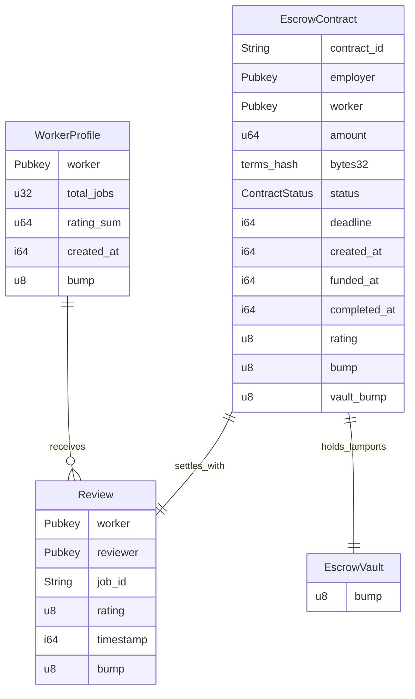

# Program Spec — P2P Work Contract & Escrow Protocol (Anchor)

**Program ID:** `FKicZKbepmiwj2rTnPrHNRBPAja3G5gSvi7KFkjHdEt9`  
**Anchor Version:** 1.2.0  
**Solana SBF:** Cargo build-sbf (arch v1)  
**Cluster:** Solana Devnet (`https://api.devnet.solana.com`)  

---

## 1. Account Architecture & PDA Seed Derivations

The ClockIn program manages 5 distinct accounts across reputation and escrow layers:



### 1.1 WorkerProfile PDA
- **PDA Seeds:** `[b"worker", worker.key().as_ref()]`
- **Purpose:** Stores aggregate reputation score and job count for a worker address.
- **Space:** `8 (discriminator) + 32 (worker) + 4 (total_jobs) + 8 (rating_sum) + 8 (created_at) + 1 (bump) = 61 bytes`

### 1.2 Review PDA
- **PDA Seeds:** `[b"review", worker.key().as_ref(), job_id.as_bytes()]`
- **Purpose:** Individual signed review with a 1–5 star rating. Existence of this PDA blocks duplicate reviews for the same job.
- **Max Job ID Length:** 32 bytes (`MAX_JOB_ID_LEN`)
- **Space:** `8 + 32 (worker) + 32 (reviewer) + (4 + 32) (job_id) + 1 (rating) + 8 (timestamp) + 1 (bump) = 118 bytes`

### 1.3 EscrowContract PDA
- **PDA Seeds:** `[b"escrow", contract_id.as_bytes()]`
- **Purpose:** Manages the full lifecycle state, terms hash, and parties of a P2P contract.
- **Max Contract ID Length:** 32 bytes (`MAX_CONTRACT_ID_LEN`)
- **Space:** `8 + (4 + 32) (contract_id) + 32 (employer) + 32 (worker) + 8 (amount) + 32 (terms_hash) + 1 (status enum) + 8 (deadline) + 8 (created_at) + 8 (funded_at) + 8 (completed_at) + 1 (rating) + 1 (bump) + 1 (vault_bump) = 186 bytes`

### 1.4 EscrowVault PDA
- **PDA Seeds:** `[b"vault", contract_id.as_bytes()]`
- **Purpose:** System-owned programmatic vault holding locked contract lamports. Controlled purely by program authority via CPI and PDA seeds.
- **Space:** `8 (discriminator) + 1 (bump) = 9 bytes`

---

## 2. Contract Lifecycle States

```rust
#[derive(AnchorSerialize, AnchorDeserialize, Clone, Copy, PartialEq, Eq)]
pub enum ContractStatus {
    Created,    // Employer initialized contract specification without depositing
    Funded,     // Employer deposited SOL into programmatic Vault PDA
    InProgress, // Worker accepted contract terms; work is underway
    Completed,  // Employer approved work; payment released & review written atomically
    Disputed,   // Party flagged dispute; funds locked pending resolution
    Cancelled,  // Employer cancelled prior to worker acceptance; funds refunded
}
```

---

## 3. Protocol Instructions

### 3.1 `register_worker`
- **Signer:** `worker`
- Initializes `WorkerProfile` PDA with `total_jobs = 0` and `rating_sum = 0`.

### 3.2 `submit_review(job_id: String, rating: u8)`
- **Signer:** `reviewer`
- Enforces `rating` between 1 and 5, and `worker != reviewer`.
- Creates `Review` PDA and updates `WorkerProfile` aggregates.

### 3.3 `create_contract(contract_id, worker, amount, terms_hash, deadline)`
- **Signer:** `employer`
- Initializes `EscrowContract` PDA in `ContractStatus::Created` state.
- Enforces `amount > 0`, `employer != worker`, and `contract_id.len() <= 32`.

### 3.4 `fund_contract(contract_id)`
- **Signer:** `employer`
- Enforces contract is in `Created` state.
- Transfers `amount` lamports from `employer` to `vault` PDA via System Program CPI.
- Initializes `vault` PDA and updates status to `Funded`.

### 3.5 `create_and_fund(contract_id, worker, amount, terms_hash, deadline)`
- **Signer:** `employer`
- Combined single-transaction convenience instruction.
- Initializes `EscrowContract` directly in `Funded` state and deposits lamports into `vault` PDA via CPI.

### 3.6 `accept_contract(contract_id)`
- **Signer:** `worker`
- Enforces contract is in `Funded` state and signer matches `contract.worker`.
- Transitions contract status to `InProgress`.

### 3.7 `release_and_review(contract_id, rating: u8)`
- **Signer:** `employer`
- **Core atomic settlement instruction:**
  1. Enforces contract status is `InProgress` and signer is `employer`.
  2. Enforces rating is between 1 and 5.
  3. Transfers `amount` lamports from `vault` PDA directly to `worker`.
  4. Creates `Review` PDA for the worker keyed to `contract_id`.
  5. Increments `WorkerProfile.total_jobs` and adds `rating` to `rating_sum`.
  6. Transitions contract status to `Completed`.

### 3.8 `cancel_contract(contract_id)`
- **Signer:** `employer`
- Valid only when contract is `Created` or `Funded` (prior to worker acceptance).
- If `Funded`, transfers all vault lamports back to `employer`.
- Transitions contract status to `Cancelled`.

### 3.9 `raise_dispute(contract_id)`
- **Signer:** `employer` OR `worker`
- Valid only when contract is in `InProgress` state.
- Transitions contract status to `Disputed`.

---

## 4. Error Code Reference

```rust
#[error_code]
pub enum ReputationError {
    #[msg("This address is already registered.")]
    AlreadyRegistered,
    #[msg("This address has not registered yet.")]
    NotRegistered,
    #[msg("Rating must be between 1 and 5.")]
    InvalidRating,
    #[msg("A review for this job has already been submitted.")]
    DuplicateReview,
    #[msg("A worker cannot review themself.")]
    SelfReview,
    #[msg("job_id exceeds maximum length of 32 bytes.")]
    JobIdTooLong,
    #[msg("contract_id exceeds maximum length of 32 bytes.")]
    ContractIdTooLong,
    #[msg("Escrow amount must be greater than zero.")]
    ZeroAmount,
    #[msg("Contract cannot be created with oneself.")]
    SelfContract,
    #[msg("Deadline must be in the future.")]
    InvalidDeadline,
    #[msg("Contract is in an invalid status for this operation.")]
    InvalidContractStatus,
    #[msg("Only the designated employer can perform this action.")]
    NotEmployer,
    #[msg("Only the designated worker can perform this action.")]
    NotWorker,
    #[msg("Worker account does not match contract specification.")]
    WorkerMismatch,
    #[msg("Arithmetic overflow.")]
    Overflow,
}
```

---

## 5. Test Harness & Coverage

Test suite executed with Anchor integration test harness (`npx ts-mocha` against local validator):
- **22 passing test cases**:
  - Worker self-registration and duplicate rejection
  - Submit review, self-review block, rating validation (1–5)
  - Lifecycle 1: Two-step create (`create_contract`) → fund (`fund_contract`)
  - Lifecycle 2: Single-step `create_and_fund` → `accept_contract` → atomic `release_and_review`
  - Lifecycle 3: Dispute flow on `InProgress` contract
  - Lifecycle 4: Cancellation and refund of `Funded` contract
  - Unauthorized signer rejection (non-employer, non-worker)
  - Balance verification after vault disbursement
